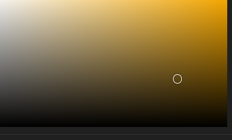

# Charte graphique et tupographique :
>En charte tupographique j'ai choisi un font-family: 'Open Sans', sans-serif  et  'Playfair Display', serif  . Vous trouverez ci-dessous la charte graphique utilisé:

